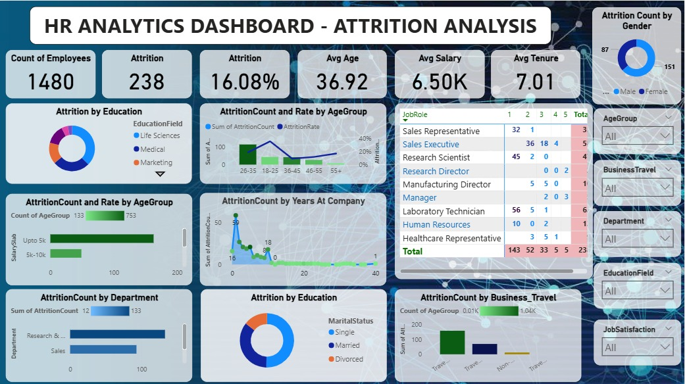

# HR Attrition Analysis Dashboard

## 📊 Overview

This project contains a Power BI dashboard that analyzes employee attrition data across various HR metrics. The goal is to identify key patterns and insights that could help reduce turnover and improve employee retention.

---

## 📁 Files Included

- `HR_Attrition_Analysis.pbix` – Power BI report file
- `d4701404-71a7-4b55-9318-2e0c1dcc1b75.png` – Dashboard preview image
  

---

## 🧠 Key Insights

- **Attrition Rate**: 16.08% out of 1480 employees.
- **Average Age**: 36.92 years
- **Average Salary**: 6.5K (in thousands)
- **Average Tenure**: 7.01 years

#### Attrition Breakdown:
- By **Education Field**: Life Sciences, Medical, Marketing, etc.
- By **Age Group**: Higher attrition among 26–35 age group.
- By **Gender**: Female employees show slightly higher attrition.
- By **Years at Company**: Newer employees show higher attrition.
- By **Department** and **Job Role**.

---

## 🛠 Tools Used

- **Power BI**
- **Excel** (for data input and preprocessing)

---

## 📌 Filters & Features

- Interactive slicers: Age Group, Gender, Department, Business Travel, Education Field, Job Satisfaction
- Dynamic visualizations with bar, pie, and line charts
- KPIs and card visuals for high-level metrics

---

## ✅ How to Use

1. Clone or download this repository.
2. Open the `.pbix` file in Power BI Desktop.
3. Refresh the data if needed and explore the interactive visuals.

---

## 📄 License

This project is for educational and portfolio purposes. Feel free to fork and use with credit.

---

## 🙋‍♂️ Author

Made by Akanksha Gupta
